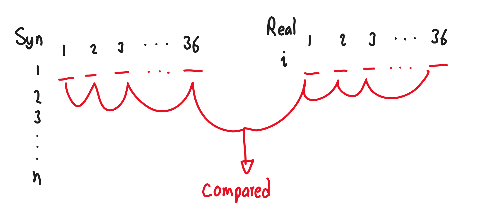

# Overview
## Introduction
This program is designed to calculate how similar a set of synthetic data is to the real data is was synthesized off of. The purpose of this is to be able to find if the data generated is actually new and unique or if it copies off the real data. This can be a huge concern for privacy reasons.
## Dataset Overview
The dataset itself contains 36 different columns. The data is present in all numerical variables with some being used to represent booleans. For more information on the dataset, go to see the
[Kaggle Dataset](https://www.kaggle.com/datasets/loveall/cervical-cancer-risk-classification?resource=download).

## Data Loading
The data is loaded into python using pandas and imported in as a pandas dataframe.
``` Python
import pandas as pd
syndata = pd.read_csv('synData9.csv')
realdata = pd.read_csv('kag_risk_factors_cervical_cancer.csv')
```
The data has some missing data and the dtypes are objects for some columns where we need them to be numbers. Before we can use the data further, we'll need to do some data cleaning to get the data into a workable format.

## Data Cleaning
To get over the issues with the dataset, we first start off by changing all the missing values to -1 and then go over and convert the dataframe to all floats. This ensuresd the dataframe will be able to be used by the code later on.

We could also simply remove rows with missing data but in this project, it would end up leaving us with too few rows. 
``` Python
def clean(data1):
    """
    Replaces the missing data with a -1 value and converts the strings into floats
    """
    for i in range(len(data1)):
        for f in data1.columns:
            if data1.loc[i, f] == "?":
                data1.loc[i, f] = float(-1)
                continue
            if isinstance(data1.loc[i, f], str):
                data1.loc[i, f] = float(data1.loc[i, f])
    data1 =data1.set_axis([f for f in range(len(data1))],   axis='index')
    return data1.astype('float')
```
From there, we need to normalize the data and in order to do that, we use min-max normalization
``` Py
def norm(data1):
    """
    Min-Max normalizes the data
    """
    new_dat = data1.copy()
    for col in new_dat.columns:
        new_dat[col] = (new_dat[col] - new_dat[col].min()) / (new_dat[col].max() - new_dat[col].min())
    return new_dat
```
Using this, we end up with a finalized dataframe full of cleaned and normalized data that we can use for the rest of the project.
## Data Weighting
Since the data will have different importance based on what column it's in, we add a weight factor to each column. Currently, the way this works is it assigns each column a high, medium or low weight.
``` Py
#Init
weights =[1,1,1,1,1,1,1,1,1,1,1,1,1,1,1,
    1,1,1,1,1,1,1,1,1,1,1,1,1,1,1,1,1,1,1,1,1]

high_weights =['Age', 'Number of sexual partners', 'First sexual intercourse',
       'Num of pregnancies', 'Smokes']
med_weights =['Smokes (years)', 'Smokes (packs/year)',
       'Hormonal Contraceptives', 'Hormonal Contraceptives (years)', 'IUD',
       'IUD (years)', 'STDs', 'STDs (number)', 'STDs:condylomatosis',
       'STDs:cervical condylomatosis']
low_weights =['STDs:vaginal condylomatosis',
       'STDs:vulvo-perineal condylomatosis', 'STDs:syphilis',
       'STDs:pelvic inflammatory disease', 'STDs:genital herpes',
       'STDs:molluscum contagiosum', 'STDs:AIDS', 'STDs:HIV',
       'STDs:Hepatitis B', 'STDs:HPV', 'STDs: Number of diagnosis',
       'STDs: Time since first diagnosis', 'STDs: Time since last diagnosis',
       'Dx:Cancer', 'Dx:CIN', 'Dx:HPV', 'Dx', 'Hinselmann', 'Schiller',
       'Citology', 'Biopsy']

for i in range(len(cols)):
    if cols[i] in high_weights:
        weights[i] = 3
    if cols[i] in med_weights:
        weights[i] = 2
    if cols[i] in low_weights:
        weights[i] = 1
```
## Comparison function
Now that the data is all set up and we have the weights prepared, we can begin with the comparison function.


## Scoring

## Ranking

## Matching
